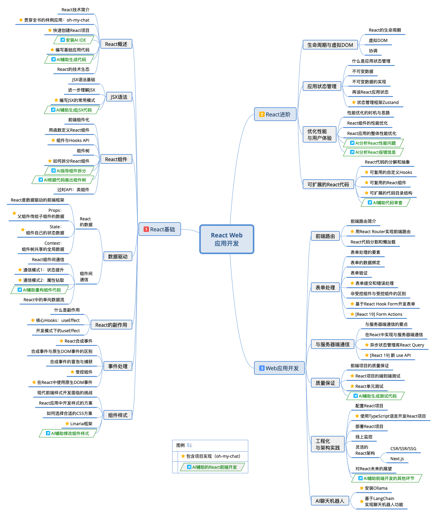
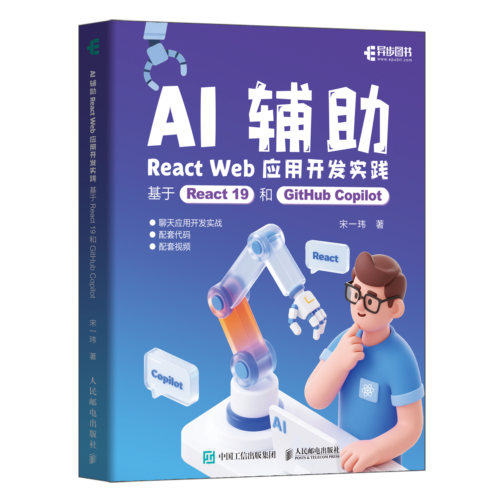

# 《AI辅助React Web应用开发实践：基于React 19和GitHub Copilot》图书配套代码

本代码仓库是《**AI辅助React Web应用开发实践：基于React 19和GitHub Copilot**》图书的配套代码。

## `oh-my-chat` 样例应用

`oh-my-chat` (《我聊》) 是一款基于React技术开发的Web聊天应用，是本书的核心案例。推荐读者从<https://github.com/evisong/oh-my-chat>或<https://gitee.com/evisong/oh-my-chat>克隆本代码仓库，以便获取最新的代码和更新。

本[`snapshots`](../../tree/snapshots)分支将各个章节的代码按目录平铺在一起，方便读者查看和学习。每个`ch*`开头的目录都包含了相应章节的代码，如`ch01_3_5`包含了1.3.5节的代码。请查看各个目录中的`README.md`文件以获取更多信息。此外，`docs`目录包含了本书的部分彩图及其他相关资源。

如果希望查看`oh-my-chat`代码演进的过程，请查看[`main`](../../tree/main)分支，及其[代码提交历史](../../commits/main)，或使用`git`命令检出`main`分支到本地进一步查看。

### 安装运行

```sh
npm install
cd ch01_3_5 # 进入对应章节目录
npm run dev
```

## 关于本书

《AI辅助React Web应用开发实践：基于React 19和GitHub Copilot》由人民邮电出版社于2025年9月出版，作者是宋一玮。本书旨在系统介绍React框架，围绕React 19的核心开发范式——函数组件和Hooks展开，并以一款聊天应用的开发为例演示如何运用现代React技术开发Web应用。另外，本书还探讨了AI辅助技术在React前端开发中的应用实践。

全书的知识地图如下：

[下载原图](docs/images/01-1-overall_mindmap.png)

欢迎扫描以下二维码购买本书：


----


